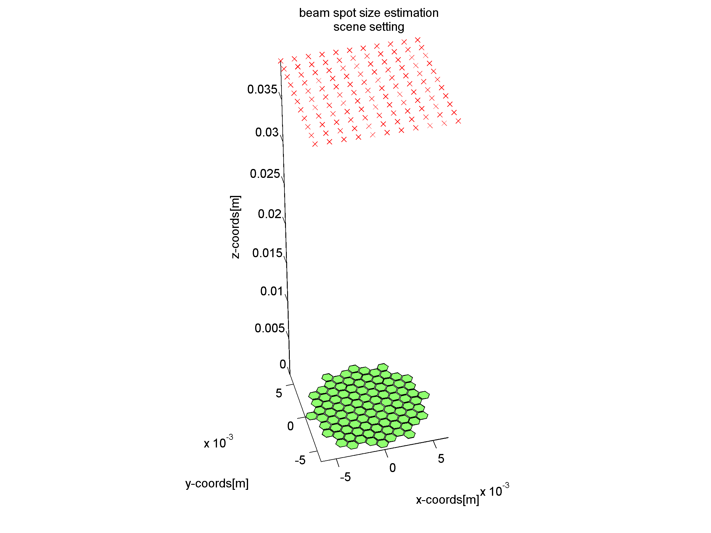
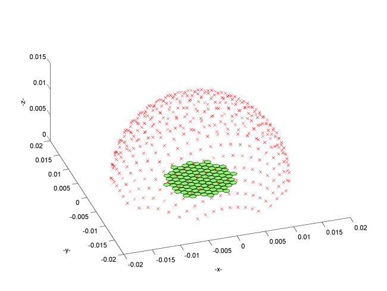
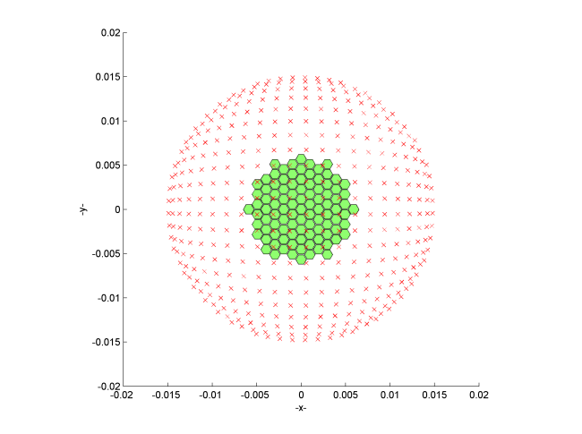
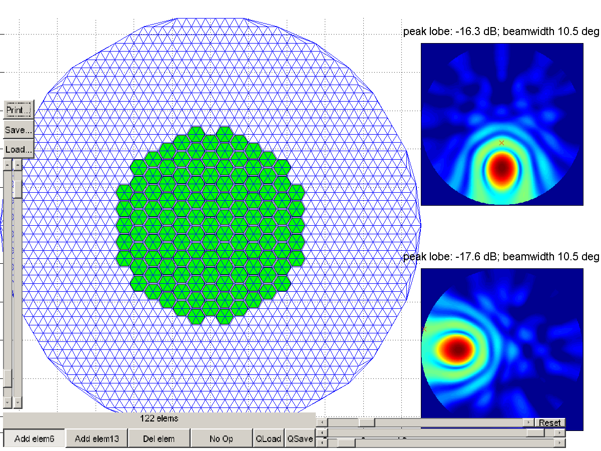
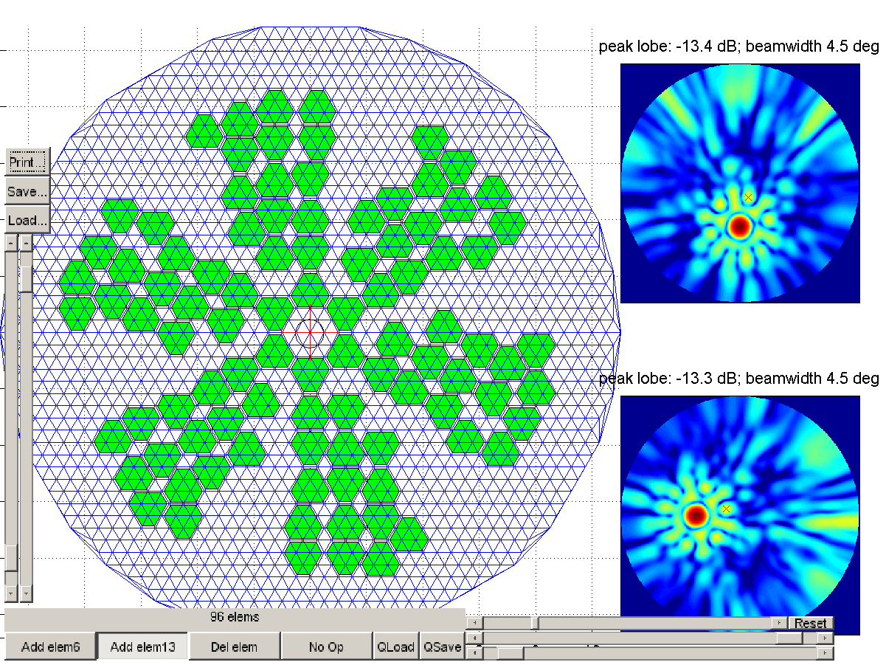

# cueBeam: acoustic beam simulation using Huygens's principle.

------

"The purpose of computer simulations is to reduce the total cost of doing the job, not to increase it" 

---- Richard O'Leary, University of Strathclyde, c.a. 2011

----

## Introduction - why cueBeam?

As of 2018, we really do not know what reality REALLY is - as far as we know, we might never know. But, we can make models. The usefullnes of the models is that they can help to explain the past and predict the future.

Models range from simple, empirical closed-form equations like Newton's "Force=Mass*acceleration", through to finite-element models (FEM) that require equation-solving with millions of unknowns. Accuracy, and therefore the usefulness of many of the models, are often compute bound. A more accurate solution can be produced at the cost of performing a greater number of computations. However, these computations bear a cost in terms of hardware, energy and, most importantly, time.  Hence, there still exists a market for building simplified models of reality; ones that capture just enough of the complexity of real phenomena, but at the same time, are computably affordable.

## cueBeam model of the world

cueBEAM is an implementation of continuous-wave (monochromatic, single-frequency) form of the Huygens principle of wave propagation in homogenous media. 

cueBeam is a Matlab/CUDA code for simulation of acoustic field pressure distribution. It calculates pressure in the frequency domain (meaning, assumes that the radiators continuously radiate) using the Huygen's principle.

This ultra-simplified propagation model enables obtaining quick estimates of pressure field shape, beam width, and side lobe amplitude, suitable for use in NDT research. It is admittedly less accurate than other published methods, but the advantage is in its speed.

Consider a dimensionles, omnidirectional monopole wave radiator emitting a continious wave at frequency f, phase phi, amplitude U0. In the media of wave velocity v, the radiator produces a stationary disturbance of wavelength lambda, and wavenumber k. The wave produced can be described at any time t and point r in space as a complex amplitude, decaying proportionally to the area of the sphere of the radius R:

Assuming that the medium of interest is a linear, non-viscous liquid and using the principle of superposition, the amplitude of the wave stemming from multiple sources of known amplitudes and phases can be calculated as a complex sum of the contributions. 

## Intended Application

cueBeam is intended for simulation of single-way ultrasonic radiation of a phased array probe. Emphasis is placed on supporting any probe geometry, including sparse 2D array probe configurations. Probe's element directivity can be simulated by representing it with multiple point-like transmitters. 

**Using the core functionality, the following additional tasks can be performed:**

Frequency-dependent phenomena can be simulated by compounding simulations of effects at indyvidual frequency. 

Time-domain  response can be calculated by encoding the excitation signal into frequency domain using FFT, then performing calculation for indyvidual frequencies, and then using IFFT to obtain the time domain signal from the cueBeam result.

##  Implementation overview

The software has been originally written as a MEX plug-in for MATLAB, and comes in two versions: CPU(OpenMP) or  CUDA for the computation kernel. The algorithm is decomposed in such a way that each thread of the GPU or OpenMP calculates the pressure value for a single-point in space only. This allows all the computations to progress in parallel, as the pressure in space is completely and solely defined by the properties of the radiators and the media. There is no need for communication between the threads.

The following inputs are required:

* Description of the radiating points: location,amplitude and phase of radiation;
* Description of the propagation media:wavenumber;
* Description of the points in space to calculate the resulting acoustic pressure.

The algorithm can be described in pseudo-code, as follows.

Radiators are described in terms of spatial XYZ location, amplitude and phase; despite them being point-like, they physically represent perfectly baffled pistons.

Propagation medium is described in terms of wavenumber k. Radiating sources are treated as point-like. For each field probing point, the pressure value is computed by summing the contributions from each transmitter, shifted by appropriate phase delay and reduced by the particular distance between the transmitter and probed point:

~~~~
	For each pixel 
		Initialize new pressure_accumulator=complex_zero;
		For each radiator
			Distance=distance_between(radiator,pixel);
			Phase_shift= wavenumber*Distance+source_radiator_phaseshift;
			Amplitude_decayed=source_radiator_amplitude/Distance;
			pressure_accumulator=increment(pressure_accumulator, complex(Amplitude_decayed, Phase_shift))
        	End for each radiator
        	Output(pixel)=pressure_accumulator;  
	End for each pixel
~~~~

## Python version:
The work has started, not much to say about it yet.

## MATLAB/CUDA Version (pre-2017):

### Preparation

The following inputs are required:

1. Locations(coordinates) of the centre of radiating elements -x,y,z.
2. 'steering vector' - a complex number describing amplitude and phase of radiation for each element. The size of the SVect must be n*1
3. Wavenumber k in the medium (single frequency only)
4. Description of the location of the field probing points. There are two versions for this: planar and spherical. The planar is called XZ (planar sampling space along XZ plane), and the spherical is called Lambert, for it uses the equal-area azimuthal sampling of a hemisphere.

 These inputs should be packed into a n*6 matrix

    tx=[elemX elemY elemZ zeros() abs(SVect(:)) angle(SVect(:))];
   

### Planar sampling version

For XZ sampling, the sampling points (where pressure is calculated) is always a regular grid described by: 
* (x0,y0,z0) - location of a corner of the grid; 
* (dx,dy,dz) - distance between points, and 
* (nx,ny,nz) : number of points in each direction.  

ny=1 always in this implementation.

The way to call the calculation function is:

	img_xz = cueBeam_xz(tx',k,x0,y0,z0,nx,ny,nz,dx,dy,dz);

Note that all inputs must be of a class single. (default for Matlab is double, so conversion is needed). This is both for speed and compatibility with early CUDA cards. No ill-conditioned math is involved, so single precision numbers deliver approximately 70-80dB of accuracy.

> Figure 1. Scene setting for cueBEAM. Green: element locations(actually, points); red cross: "probe points" where the field is calculated. Note that this is an old version of the figure and the default probing points are XZ only.(** to do: create updated image showing correct XZ plane!**)

### Hemisphere sampling version

For beamsim_Lambert the calling convention is simpler:

	[img_lambert lambert_x lambert_y lambert_z]=cueBeam.cueBeam_lambert(tx', k, r, density); 

This program automatically generates a mesh of points that are distributed over a hemisphere with radius R, and distance between real points "density", in such way, that the true area (and thus, energy flux) covered by a given sampling point is equal for all points. The points are then mapped(recorded on) to a flat rectangular grid, and stored as such in memory. The transformation rules are (after http://mathworld.wolfram.com/LambertAzimuthalEqual-AreaProjection.html ) . 

R is the radius of the sphere, and 'density' is an approximate linear distance between points on the sphere. The resulting resolution of the field image can be calculated by:

    number_of_points=ceil(2*pi*r/density);
    d=2*sqrt(2)/number_of_points;
    n=ceil(2*sqrt(2)/d); % note, the double scaling is needed to obtain correct rounding.
    img_lambert=zeros(n,n,'single'); 

Inverse transformation rules are used to calculate standard parallel   and central longitude on the sphere:   

 
>Figure 2. Lambert azimuthal equiareal map field probing point distribution.

p.s. I know that actually, the thing that is named 'density' should be named "reciprocial of density" or "specific volume" or 'ApproximateDistanceBetweenPoints' - or something like this - in any case, the lower the number, the more pixels You get. But I needed a shorter name quickly. If you find a right single word for this term, let me know!

### Why hemisphere, and why this fancy sampling method?

When compared to regular orthogonal grid, there are two important advantages of this approach:
1. Due to each pixel covering the same area, and thus, flux, the true power of the sidelobes can be easily integrated and compared with the power of the main lobe. This reduces error of estimating the sidelobe level for classic beamforming, and therefore is more representative of the image contrast from the operator's point of view. 
2. The points on a hemisphere are __aproximately__ equidistant from the probe's centre, meaning that the time-of-flight from the probe to these points is nearly equal. This means, that the integrated side lobe amplitude is more representative of the actual image contrast that one would get in real life with time-domain signals. This is because the signals coming in **from the side lobe directions** and **at the same time** would colide and interfere with the reflectors insonified by the main beam --- and due to this spatial-temporal collision, are difficult to separate (and normally not separated in any classic algorithm like B-scan, TFM, e.t.c).

To summarize, this fancy hemisphere sampling gives you results that are more representative of the final image quality (compared to regular 'rectangular region of a plane' sampling).

### Example

An example on how to define parameters for use with cueBeam are provided in the MATLAB file:

[cueBeam_linear_array_basic](https://github.com/CentreForUltrasonicEngineering/cueBeam_EngD/blob/master/beamsim_release06/cueBeam_linear_array_basic.m)

## Demos and applications

Please note that essentially, only the core calculation module is supported. It is up to the user to make the it useful to himself.

###  ArrayEdit3: Sparse array editor

A sparse array CAD package has been built to facilitate the exploration of sparse array element layouts. This package allows for the placing and moving of the array elements defined over a triangular grid. The performance of the resulting element in terms of main lobe width and side lobe amplitude is recalculated and updated interactively as the elements are added, modified and removed. 
An example screenshot of the editor in use is presented in figure below (densely packed array) and another (sparse array). These two figures exemplify an exploration of the problem space in placing the elements on a triangular grid. In the first figure, the elements that cover six triangles are densely placed. In the second, the elements that cover 12 triangles are sparsely placed. The beam width is narrower for the sparse array, however the side lobe level is higher (the contrast is worse).

### BeamDemo:Interactive beam forming and focussing demonstration

A software package has been built to interactively demonstrate the effects of changing the probe aperture, bandwidth, element count and the steering and focussing on the beam shape and image quality metrics. An example screenshot is presented in below.
The scene settings and the probe itself are defined by means of a Matlab script. 
The three main displays are interactively updated. The XZ cross-section display is a 2D slice of the 3D space defined by plane y=0. The hemisphere display is a 2D slice of the 3D space, defined by a hemisphere of radius as dictated in the settings.  Both of these displays present the calculated relative amplitude of the pressure field generated by the probe. They are also used to visualise the location of a curve (semicircle, white in the figure) that is used as a final 1D cross-section of the beam. The pressure sampled at the location along this curve is displayed in the bottom plot.
Based on the 1D cross-section, example beam characteristics are calculated: main lobe width (planar angle, width of the -3dB envelope) and leakage factor (ratio of the energy outside the main lobe to the total signal energy in the measurement plane).
The user can click the XZ or hemisphere images to direct and focus the beam at that point, instantly updating the display. Keyboard shortcuts are used to modify probe characteristics, such as to make it bigger or smaller or to change the radiation frequency.

### Gallery of simulation examples

See [this document](https://github.com/CentreForUltrasonicEngineering/cueBeam_EngD/blob/master/cueBEAM-learning-resources/2017-06-06%20Gallery%20of%20beam%20simulation%20examples.docx)

### exercise script for EngD ultrasonics course
See [this document](https://github.com/CentreForUltrasonicEngineering/cueBeam_EngD/blob/master/cueBEAM-learning-resources/2017-06-6%20Lab%20script%20v1.docx)

## where to get it

See [this repo](https://github.com/CentreForUltrasonicEngineering)

